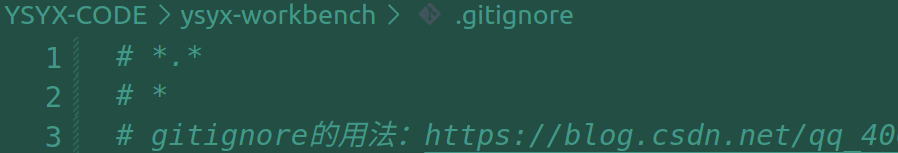

# ysyx-preLearning1

> 2023/04/08 感觉自己的远端仓库有点问题，所以还要重新回顾一下PA0，看看到底咋回事。
>
> 解决后补充：是gitignore的问题，把所有非指定文件都指定为忽略了。具体见下图：
>
> 
>
> 以下基本上就是PA0 安装 ubuntu 的相关内容。

## 1. Ubuntu20.04.4 安装

## 2. Exploration on Ubuntu20.04

之前为了机器人比赛，装过 Ubuntu18.04 ，但也是之前的事情了。但这次装 Ubuntu 换源的时候居然脑子抽风去粘贴了 Ubuntu18.04 的源过来，直接导致崩盘。

## 3. Installing Tools

注意先换源。

就是几个命令行：

```shell
sudo apt-get install build-essential    # build-essential packages, include binary utilities, gcc, make, and so on
sudo apt-get install man                # on-line reference manual
sudo apt-get install gcc-doc            # on-line reference manual for gcc
sudo apt-get install gdb                # GNU debugger
sudo apt-get install git                # revision control system
sudo apt-get install libreadline-dev    # a library used later
sudo apt-get install libsdl2-dev        # a library used later
sudo apt-get install llvm llvm-dev      # llvm project, which contains libraries used later
```

## 4. Vim

安装：

```shell
sudo apt-get install vim
```

获取vim教程有两种方式：

1. 终端输入 `vimtutor`即可看到教程，但是因为系统环境选的是英文，感觉有点费力。
2. 在网上搜 vim 教程。

用 Vim 创建一个文件

```shell
vim test
```

> 程序设计课上你学会了使用Visual Studio, 然后你可能会认为, 程序员就是这样写代码的了. 其实并不是,  程序员会追求那些提高效率的方法. 不是GUI不好, 而是你只是用记事本的操作方式来写代码. 所以你需要改变,  去尝试一些可以帮助你提高开发效率的工具.

> 在GNU/Linux中, 与记事本的操作方式相比, 学会 `vim`的基本操作就已经可以大大提高开发效率. 还有各种插件来增强 `vim`的功能, 比如可以在代码中变量跳转的 `ctags`等等. 你可以花点时间去配置一下 `vim`, 具体配置方式请STFW. 总之, "编辑器之神"可不是浪得虚名的.

话是这么说，我感觉挺麻烦的。

下面我要写一个Hello World程序，并用makefile编译它。

主要参考为：https://blog.csdn.net/hjxu2016/article/details/100672126

期间遇到了问题为：

```shell
zzrs123@zzrs123:~/testrc/test1$ make
makefile:8: *** missing separator.  Stop.
```

参考教程为https://blog.csdn.net/limanjihe/article/details/52231243

**问题就是命令之前需要TAB，而不是空格。**

 创建文件夹

```shell

mkdir testrc
cd testrc
mkdir test1
cd test1
vim hello.c

```

编写 helloworld 程序

```c
#include<stdio.h>
int main(){
    printf("Hello World");
    return 0;
}
```

编写 makefile

```shell
vim makefile
```

```makefile
#语法规则
# target ...:pre-requisities...
# 目标文件...:先决条件
# targe 这一个或多个的目标文件依赖于 pre-requisities中的文件
# command, 下面是命令

hello:hello.c
        gcc hello.c
.PHONY:clean
        -rm hello
# .PHONY 意为 clean 是一个伪目标
# 而在 rm 前加入 - 意为，也许某些文件出现问题，但不要管，继续做后面的事情

# 也可以
#clean:
#  -rm hello
# 但不推荐这么做，如果在当前目录下存在一个clean，就不需要执行clean后面的规则了
```

`<esc>` + :wq! + Enter退出后，操作如下：

```shell
zzrs123@zzrs123:~/testrc/test1$ make
gcc hello.c
zzrs123@zzrs123:~/testrc/test1$ ls
a.out  hello.c  makefile
zzrs123@zzrs123:~/testrc/test1$ ./a.out
hello world!
```

## 5. gdb调试

代码：

```C
#include<stdio.h>
void sum(int m);

int main(){
        int i,n=0;
        sum(50);
        for(i = 1; i <= 50; i++){
                n +=i;
        }
        printf("The sum of 1 - 50 is %d \n",n);
        return 0;
}

void sum(int m){
        int i,n=0;
        for(i=1;i<=m;i++) n+=i;
        printf("The sum of 1 - m is %d\n",n);
}

```

参考教程：

https://blog.51cto.com/u_15262460/2882577

只能说超级详细。

mark一下， 0628看到了gdb调试完成，后面是make工程相关的内容。

回头总结一下这部分的内容，整个博文。

## 6. tmux 终端管理器

这个用来分屏十分方便。参考教程：

https://zhuanlan.zhihu.com/p/98384704

基本就可以通过一个终端来切换不同的端口，只需要通过命名来管理一下即可。

## 7. 关于为什么要使用 Linux？

我觉得这部分是最重要的，以为我一直不能很好的回答一些非CS的同学关于为何使用 Linux 的提问。

- 比较两个文件是否完全相同？

  在Linux下就是 `diff` 命令，如果文件太大，那就是 `mdSsum` 来比较 MD5 。输入这些命令很快，而在Windows下就必须下载 MD5 的计算工具。
- 如何列出一个C语言项目中所有被包含的头文件？

  Linux 下只需要：

  ```shell
  find . -name "*.[ch]" | xargs grep "#include" | sort | uniq
  ```

  看起来很神奇，具体来说就是 `man` 的使用。下面是对于ysyx官网的摘抄：

  > Unix 的 “哲学”：
  >
  > 1. 每个工具只做一件事情, 但做到极致
  > 2. 工具采用文本方式进行输入输出, 从而易于使用
  > 3. 通过工具之间的组合来解决复杂问题
  >
  > Unix哲学的最后一点最能体现Linux和Windows的区别: 编程创造.
  >
  > 如果把工具比作代码中的函数, 工具之间的组合就是一种编程. 而Windows的工具之间几乎无法组合, 因为面向普通用户的Windows需要强调易用性.
  >
  > 所以, 你应该使用Linux的原因非常简单: **作为一个码农, Windows一直在阻碍你思想, 能力和效率的提升.**
  >

## 8. 关于如何用好Linux?

虽然已经接触了一年的 Ubuntu 了，主要用于机器人ROS的开发，但对于 Linux 确实是没有更深入学习。（ ysyx 居然号召我卸载 Windows 。）

Linux 上也有与Windows 下类似的工具，总有对的工具帮自己做的更好，要愿意花时间来***找到、学习、使用。***

> 平时基本需要的工具有：
>
> 1. 文件管理 - `cd`, `pwd`, `mkdir`, `rmdir`, `ls`, `cp`, `rm`, `mv`, `tar`
> 2. 文件检索 - `cat`, `more`, `less`, `head`, `tail`, `file`, `find`
> 3. 输入输出控制 - 重定向, 管道, `tee`, `xargs`
> 4. 文本处理 - `vim`, `grep`, `awk`, `sed`, `sort`, `wc`, `uniq`, `cut`, `tr`
> 5. 正则表达式
> 6. 系统监控 - `jobs`, `ps`, `top`, `kill`, `free`, `dmesg`, `lsof`
> 7. 上述工具覆盖了程序员绝大部分的需求
>    - 可以先从简单的尝试开始, 用得多就记住了, 记不住就 `man`

ysyx 推荐的教程：[The Missing Semester of Your CS Education](https://missing.csail.mit.edu/)

命令行教程：https://github.com/jlevy/the-art-of-command-line

> 有中文版。

## 9. Git 相关的操作

其实之前就接触过 git，但是现在看来根本不了解。

这次主要是亲身体验了 `git branch`的用处，**即一个分支下做的改变不会影响另一分支**。我觉得这才是版本控制的精髓所在。

具体为：

```shell
git branch
# 查看分支
git checkout -b pa0
# 创建pa0分支
# 此后的修改和提交只在该分支下可见。
git status
# 查看上次的修改（未提交）
git diff
# 查看修改内容
#通过git add添加要提交的更改，并发出git commit
# git commit 之后就能通过git log 查看提交记录

# 以上这些修改都只在pa0下，切换回master就会发现没有改动。
# 这就是git的魔力。
# 切换分支
git checkout branchname

# 历史记录
git log
# 筛选指定用户的提交
git log --author="zzrs123"
# 参考：https://www.codegrepper.com/code-examples/shell/git+log+by+author
```


此外，git 的空提交：https://www.freecodecamp.org/news/how-to-push-an-empty-commit-with-git/，不过目前没感觉有什么用。用到再回来补充吧。

```shell
git commit --allow-empty -m "Empty-Commit"
```

此外，还有一个可视化学习 Git 的网站：http://onlywei.github.io/explain-git-with-d3/

以及一个比较有趣的教程https://ysyx.oscc.cc/docs/ics-pa/git.html#%E5%85%89%E7%8E%89

## 10. 关于提交到自己的仓库

> 2023年回来看2022年自己的谜之操作，感觉为什么在这么简单的事情上做这么复杂的事情。如果现在做，基本就是：
>
> * git add my_repo url，把自己的远端仓库加到本地仓库的git里，此后就可以将这个仓库git push my_repo branch 了
> * 同样可以检测到南大的源仓库的最新变化，也可以将代码推送到自己的仓库里。
>
> 下面是2022年6月、7月自己做的事情：（做的比较麻烦......）

修改分支：我想把pa0改为main，提交到自己的Github来管理:

> #### 1、本地分支重命名
>
> `git branch -m oldName newName`
>
> #### 2、 远程分支重命名
>
> - 重命名远程分支对应的本地分支
>
>   `git branch -m oldName newName`
> - 删除远程分支
>
>   `git push --delete origin oldName`
> - 上传新命名的本地分支
>
>   `git push origin newName`
> - 把修改的本地分支与远程分支关联
>
>   `git branch --set-upstream-to origin/newName`
>
> #### 3、查看当前代码仓库源
>
> - 查看当前源
>
>   `git remote -v`
> - 重设
>
>   `git remote set-url origin xxxx_url`

这个项目代码本来是跟源仓库绑定的，问了群里大佬，说只改动url不会有事，又折腾了很久，成功将两个分支 `main`和 `oscpu`提交到了我的仓库，具体怎么实现的可以等后面再实践和整理。

反复报错了很多，就是连接不上远端，推送到了没有连接的远端...等等。阻碍主要是在于：

1. 本地是否能够识别origin的url，这个通过一些设置即可解决
2. 远端新建立了一个仓库，顺手初始化了一个 License 和 README.md，这造成了本地和远端的冲突。

主要解决办法：

1. 对于第一个阻碍，设置url即可。具体方法参考https://blog.csdn.net/weixin_42094764/article/details/118443330
2. 主要是把远端pull了下来，然后再进行push，这样远端和本地就同步了。https://blog.csdn.net/generallizhong/article/details/96115192

但在这之后，虽然看到本地提交到了自己想提交的仓库，但是提交还是需要：

```shell
git push ssh-addrss main
```

而不能通过 origin 来代替。

参考一下文章：https://cloud.tencent.com/developer/article/1861466

其实很简单，自己在.git 文件夹下的 config 文件中 把 url 改成了 https 地址，而自 2021 年起，Github 不再支持账户密码登录远端，把 config 文件中的 url  换成 ssh 地址即可正常 push。

git如何合并远端两个分支：

- [git如何合并远程2个分支,总步骤](https://blog.51cto.com/u_15060464/4339663)
- [git merge命令  |  解决Git中fatal: refusing to merge unrelated histories](https://blog.csdn.net/generallizhong/article/details/96115192)
- [处理 git 合并时的冲突问题(即两个分支下的同名文件冲突)](https://www.cnblogs.com/lowmanisbusy/p/9054087.html)

当然，得检查一下自己的 git log 是否正常。检验后都记录在案，放心。

## 11. 2023/4/08 后记

想要重启这个项目的学习，翻看了之前的笔记，这是在大二暑期的笔记了。将近了快一年，感觉还好，对本文涉及的内容更熟悉了，这次再来就对计算机系统有了更全面的了解。
