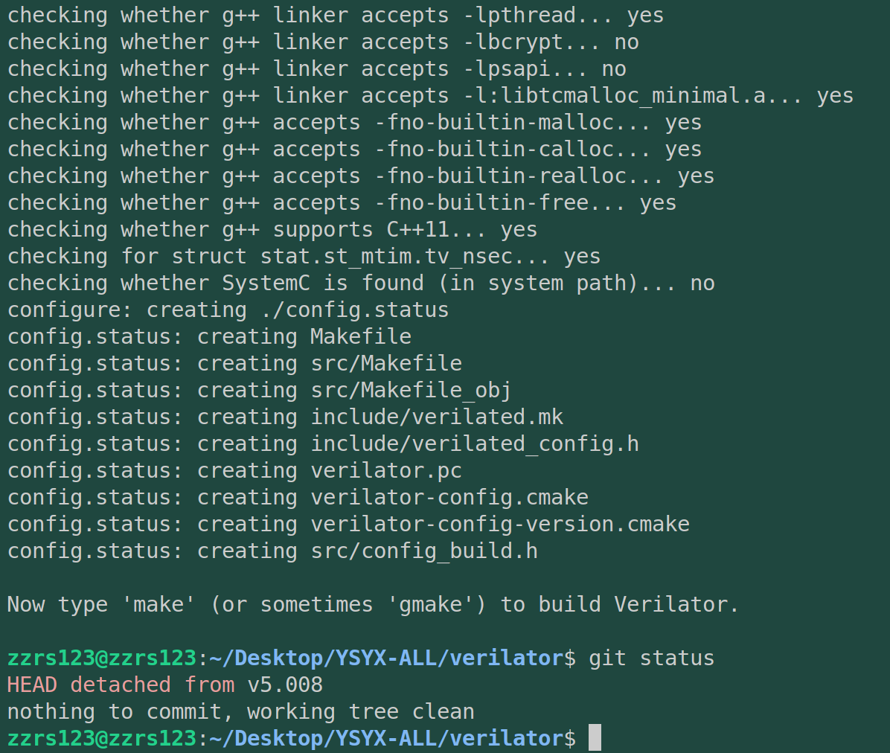
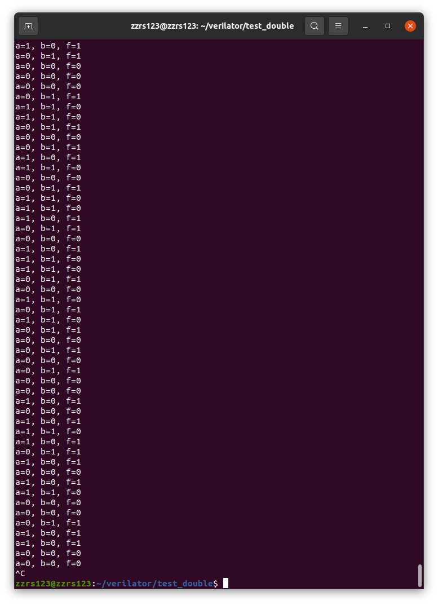
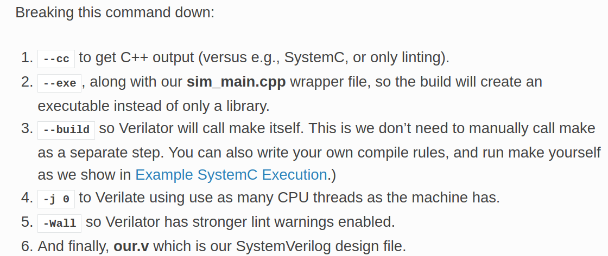
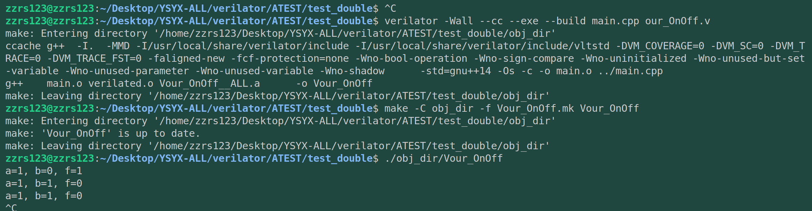
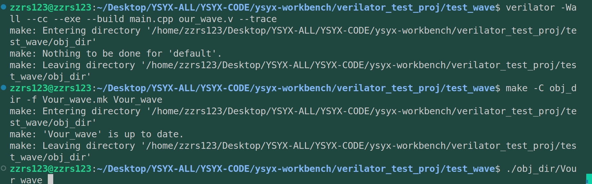
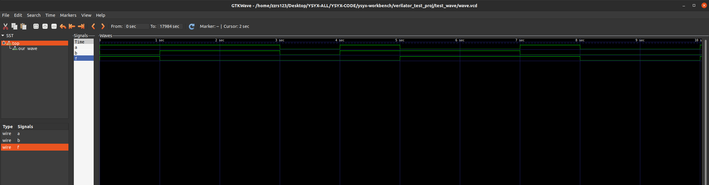

# ysyx-preLearning2

## 1. 复习C语言

在 pa0 的末尾，除了提醒我们牢记：

- STFW
- RTFM
- RTFSC

还提醒我们要复习C语言，这在后面会用到。一生一芯要求掌握的C语言程度：递归、指针、链表。

推荐教程：

- [Linux C编程一站式学习](https://docs.huihoo.com/c/linux-c-programming/)
- [The C programming language (2nd Edition)](http://math.ecnu.edu.cn/~jypan/Teaching/ParaComp/books/The C Programming Language 2nd.pdf)
- [SEI CERT C Coding Standard](https://wiki.sei.cmu.edu/confluence/display/c/SEI+CERT+C+Coding+Standard)
- 本阶段相关资源:
  - 录播
    - [C 语言拾遗 (1): 机制 (第一次录播, 录音效果较差)](https://www.bilibili.com/video/BV1qa4y1j7xk?p=1)
    - [C 语言拾遗 (2): 编程实践](https://www.bilibili.com/video/BV1qa4y1j7xk?p=2)
  - 课件
    - [C 语言拾遗 (1): 机制](http://jyywiki.cn/ICS/2020/slides/2.slides)
    - [C 语言拾遗 (2): 编程实践](http://jyywiki.cn/ICS/2020/slides/3.slides)

此外，verilator 会编译出C++ 文件，也需要了解一点点C++ 的基本知识。这个我应该没啥问题。后续用到再说。

不知道为什么不能访问以上链接，下载了一个谷歌也不行。[如何在 Ubuntu 20.04 上安装 Google Chrome 网络浏览器](https://zhuanlan.zhihu.com/p/137114100)

不过C语言资源很多，不至于应付不过来。

## 2. 搭建 Verilator 仿真环境

### 2.1 安装

> 2023/04/08 手册上说明了要源码安装，以便指定特定的版本。但是我又翻看了一下，emm，4.210已经过期了，现在指定5.008。OK, that's fine. 我重新来一遍。

```bash
# Prerequisites:
#sudo apt-get install git perl python3 make autoconf g++ flex bison ccache
#sudo apt-get install libgoogle-perftools-dev numactl perl-doc
#sudo apt-get install libfl2  # Ubuntu only (ignore if gives error)
#sudo apt-get install libfl-dev  # Ubuntu only (ignore if gives error)
#sudo apt-get install zlibc zlib1g zlib1g-dev  # Ubuntu only (ignore if gives error)

git clone https://github.com/verilator/verilator   # Only first time

# Every time you need to build:
unsetenv VERILATOR_ROOT  # For csh; ignore error if on bash
unset VERILATOR_ROOT  # For bash
cd verilator
git pull         # Make sure git repository is up-to-date
git tag          # See what versions exist
#git checkout master      # Use development branch (e.g. recent bug fixes)
#git checkout stable      # Use most recent stable release
#git checkout v{version}  # Switch to specified release version
git checkout v5.008

autoconf         # Create ./configure script
./configure      # Configure and create Makefile
make -j `nproc`  # Build Verilator itself (if error, try just 'make')
sudo make install
```

查看版本：

```bash
verilator --version
# 输出 Verilator 4.210 2021-07-07 rev v4.210
```

安装成功。



> 2023/04/08 按照ysyx官方文档，接下来需要运行一个C++示例。

### 2.2 C++例程

[官网例程地址](https://verilator.org/guide/latest/example_cc.html#example-c-execution)

> 注我们是从源码下载编译得到的，所以例程需要在verilator文件夹下编译。
>
> ====2023/04/08=====
>
> 其实也可以在自己的文件夹下进行，verilator安装后是全局的。

参考教程：

1. [Unbuntu21.04安装Verilator --4.210](https://blog.csdn.net/qq_43209432/article/details/123049094)
2. 官网：差别是没有切换分支，切换分支才能下载4.210这个版本https://verilator.org/guide/latest/install.html

> 2023/04/08：这一点我在重复安装的时候就发现去年此时没有checkout。

## 3. Verilator 的使用

> 2023/04/08：例程代码放在verilator的ATEST/test_double文件夹下

上面的示例非常简单, 甚至算不上是一个真正的电路模块. 接下来我们编写一个真正的电路模块, 双控开关, 来进行测试. 编写如下的verilog代码:

```verilog
module our_OnOff(
  input a,
  input b,
  output f
);
  assign f = a ^ b;
endmodule
```

> 2023/04/09，很明显，这是一个与门，ysyx官方文档中叫他双控门。为了区分，我没有使用top.v来命名，使用的是our_OnOff.v。

main.cpp编写：

```c++
#include<stdio.h>
#include<stdlib.h>
#include<assert.h>
#include"Vour_OnOff.h"

int main(int argc,char **argv){
  Verilated::commandArgs(argc,argv);
  Vour_OnOff *top = new Vour_OnOff("top");
  while(!Verilated::gotFinish()){
    int a = rand() & 1;
    int b = rand() & 1;
    top->a = a;
    top->b = b;
    top->eval();
    printf("a=%d, b=%d, f=%d\n", a, b, top->f);
    assert(top->f == a ^ b);
  }
  delete top;
  return 0;

}
```



参考教程：https://blog.csdn.net/qq_54467680/article/details/123617689

运行Cpp和.v文件的仿真一共有三步：

1. 生成目标文件夹obj_dir

   ```bash
   verilator -Wall --cc --exe --build main.cpp our_OnOff.v
   ```

   --Wall，把所有警告warning都当做error

   --cc，get C++ output

   --exe，构建可执行文件，而不是一个文件夹

   --build，调用make本身

   [obj_dir里文件的解释](https://verilator.org/guide/latest/files.html#files-read-written)，感觉是verilator按照一定的规则继续补充生成的代码，以便达到Cpp和.v文件的融合编译。

   
2. 编译

   ```bash
   make -C obj_dir -f Vour_OnOff.mk Vour_OnOff
   ```
3. 运行

   ```bash
   ./obj_dir/Vour_OnOff
   ```

这里是2023/04/08重新做的截图：



## 4. GTKWave 查看波形

=============2023/04/08，从这里重新开始==============

查看波形文件是RTL调试的常用手段之一. verilator支持波形的生成, 你可以通过开源的波形查看工具GTKWave来查看波形.

安装：

```bash
apt-get install gtkwave
```

具体代码见：verilator_test_proj/test_wave中



而波形文件产生在test_wave文件夹下。直接双击这个wave.vcd即可打开GTKWave，跟Modelsim一样，将信号拖入右侧，即可看到对应的波形：



## 5. 一键仿真：编写Makefile

下面就要回到npc文件夹（new-processor-core）下尝试用Makefile进行编译，把上面复杂的各个命令综合起来。如果要把所有命令写到一个make里，就涉及一个定时执行的问题（也就是让vour_wave运行固定的时间），但是还是会错误：

```makefile
sim:
	@echo "Write this Makefile by your self."
	verilator -Wall --cc --exe --build csrc/main.cpp vsrc/our_wave.v --trace
	make -C obj_dir -f Vour_wave.mk Vour_wave
	timeout 2 ./obj_dir/Vour_wave # 2s后结束执行
	gtkwave wave.vcd
```

在使用timeout使得Vour_wave在给定的2s之后结束，此时make sim也停止了，不会再向下执行gtkwave这一句。

所以还是放弃了这种一锅端的方式，把各个环节单独写到单独的make命令里：

```makefile
ifneq ($(words $(CURDIR)), 1)
    $(error Unsupported: GNU Make cannot build in directories containing spaces, build elsewhere: '$(CURDIR)')
endif

ifeq ($(VERILATOR_ROOT),)
    VERILATOR = verilator
else
    export VERILATOR_ROOT
    VERILATOR = $(VERILATOR_ROOT)/bin/verilator
endif
all:
	@echo "Write this Makefile by your self."

# sim:

# 	@echo "Write this Makefile by your self."
# 	verilator -Wall --cc --exe --build csrc/main.cpp vsrc/our_wave.v --trace
# 	make -C obj_dir -f Vour_wave.mk Vour_wave
# 	timeout 2 ./obj_dir/Vour_wave # 2s后结束执行
#	gtkwave wave.vcd
build:
	$(VERILATOR) -Wall --cc --exe --build csrc/main.cpp vsrc/our_wave.v
	make -C obj_dir -f Vour_wave.mk Vour_wave
wave:
	$(VERILATOR) -Wall --cc --exe --build csrc/main.cpp vsrc/our_wave.v --trace
	make -C obj_dir -f Vour_wave.mk Vour_wave
run:
	$(VERILATOR) -Wall --cc --exe --build csrc/main.cpp vsrc/our_wave.v --trace
	make -C obj_dir -f Vour_wave.mk Vour_wave
	./obj_dir/Vour_wave
sim:
	$(call git_commit, "sim RTL") # DO NOT REMOVE THIS LINE!!!
	gtkwave wave.vcd
clean:
	-rm -rf obj_dir
include ../Makefile

```

现在 <编译、运行、仿真> 就只需要：

* make clean
* make run
* make sim

> makefile 还是写的比较丑，我记得 -Wall --cc --exe --build 这种都是可以写别名的。


## 6. 接入NVBoard

[NVBoard](https://github.com/NJU-ProjectN/nvboard.git)(NJU
 Virtual Board)是南京大学开发的，用于教学的虚拟FPGA板卡项目，可以在RTL仿真环境中提供一个虚拟板卡的界面，支持拨码开关,，LED灯， VGA显示等功能，在速度要求不高的场景下可完全替代真实的FPGA板卡(毕竟不是每人身边都有一块FPGA).
通过以下命令获取NVBoard的代码:

```bash
cd ysyx-workbench
bash init.sh nvboard
```

上面这个命令其实就是git获得nvboard的源代码并完成配置，可以通过查看源码来理解nvboard是怎么工作的（毕竟是南大同学写出来的）。
