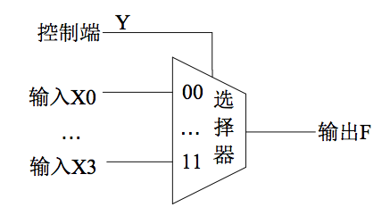
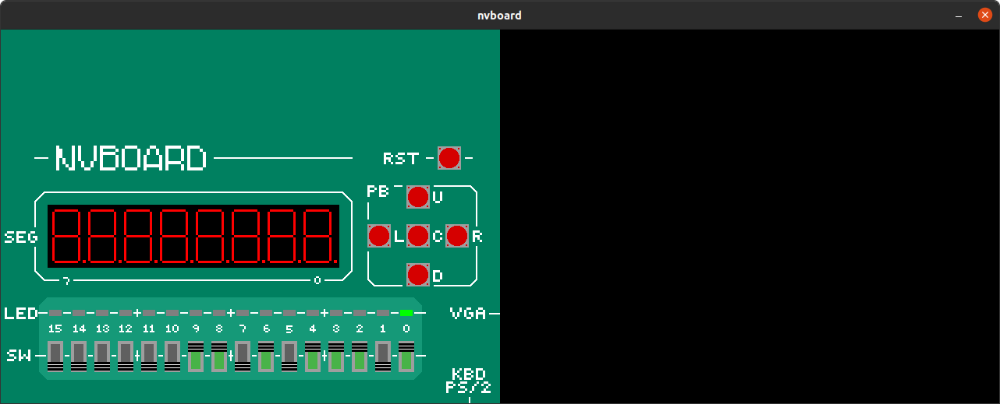
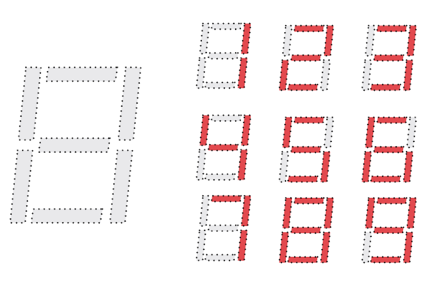
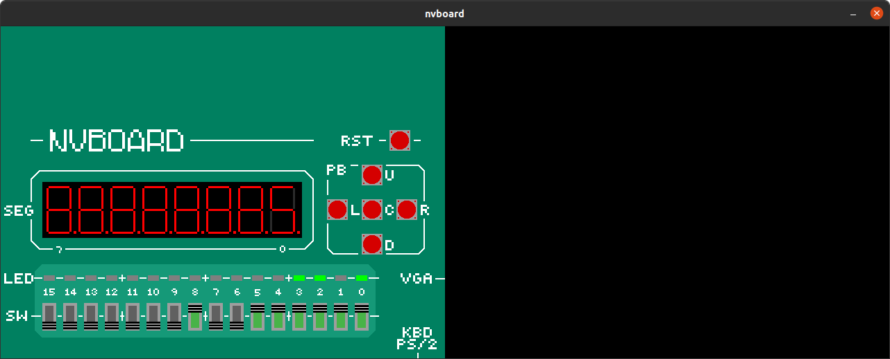

# ysyx-preLearning3

数字电路基础实验。

这里主要是实验完成记录和实验报告，verilog以及其他知识的学习会单列笔记。这里课程给出的资源比较多，慢慢学。

## 0. 资源整理

## 1. lab1:mux

### 1.1 阅读手册

* 多路选择器从多路输入中，选取其中一路将其传送到输出端，由选择控制信号决定输出的是第几路输入信号。
* 数字电路中存在大量的并行运算，通常的设计思路是使用电路同时生成所有可能用到的数字信号，再利用选择器选择最终输出哪一路信号。

> 这里看实验手册突然来了个卡诺图，感觉数字逻辑的知识忘记的有点多了。

波形仿真这里NJU是采用Multisim进行，我们这里自然是接入NVBoard了。

> 别人家的实验手册啊，讲的挺清楚。很喜欢这个实验手册的表述。

这里手册上提到初学者不要使用行为建模方式设计电路，因为这种方式太像面向过程编程，不能很好地培养硬件思维。**真正的描述电路 = 实例化 + 连线。**

* HDL设计电路，就是在用HDL来描述电路图纸，图纸上有什么，就直接描述什么。所以，用HDL描述电路，无非是做两件事情：
  * 实例化：在电路板上放一个元件/模块，可以是一个门电路，或者是由门电路组成的模块
  * 连线：用导线将元件/模块的引脚正确地连起来
* 所以数据流建模方式是处于输入输出信号的逻辑关系（表达式）来描述电路，而结构化建模则是实例化电路中的所有器件，再将其连接起来，完成电路。
* 而行为建模方式就绕了一个远路，拿到电路，先在脑子里想它的工作行为，然后写出这个工作行为的代码，别人拿到代码，翻译出工作行为，再转换为电路。

### 1.2 验收内容

二位四选一选择器

用选择器模板实现一个2位4选1的选择器，如下图所示，选择器有5个2位输入端，分别为X0, X1, X2, X3和Y，输出端为F；X0, X1,X2, X3是四个2位的输入变量。输出F端受控制端Y的控制，选择其中的一个X输出，当Y = 00时，输出端输出X0，即F = X0；当Y =01时，输出端输出X1，即F = X1；以此类推。

选择开发板上的SW0和SW1作为控制端Y，SW2—SW9作为四个两位数据输入端X0–X3，将两位的输出端F接到发光二极管LEDR0和LEDR1上显示输出，完成设计，对自己的设计进行功能仿真，并下载到开发板上验证电路性能。

### 1.3 完成实验

随机把SW2~SW9按下，置位控制信号Y为01，也就是选择输入信号X2作为输出，X2此时为01，而可见两位LED灯的亮灭情况就是01。

## 2. lab2:dec&enc

### 2.1 阅读手册

译码器是将某一输入信息转换为某一特定输出的逻辑电路，将 m 位的输入编码转换为 n 位的编码输出。然后实验手册开始介绍2-4译码器和3-8译码器。之后讲解了对应的编码器。

不得不记录七段数码管的显示方式：

### 2.2 验收内容

实现一个8-3优先编码器并在七段数码管上显示。

### 2.3 完成实验

下图可以清晰看到优先级，比5低的码位都会被屏蔽。

