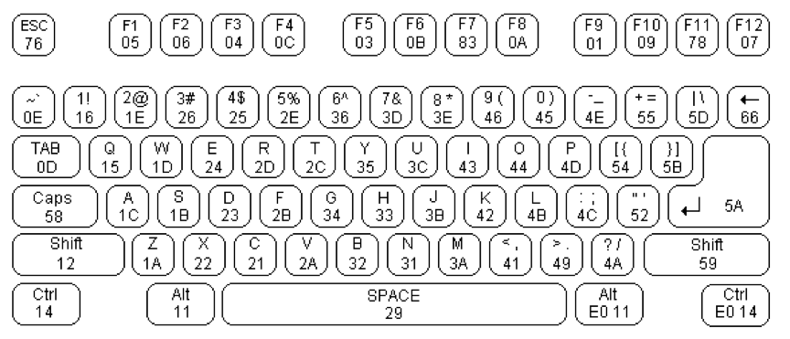

# ysyx-preLearning3

数字电路基础实验。

这里主要是实验完成记录和实验报告，verilog以及其他知识的学习会单列笔记。这里课程给出的资源比较多，慢慢学。

## 0. 资源整理

## 1. lab1:mux

### 1.1 阅读手册

* 多路选择器从多路输入中，选取其中一路将其传送到输出端，由选择控制信号决定输出的是第几路输入信号。
* 数字电路中存在大量的并行运算，通常的设计思路是使用电路同时生成所有可能用到的数字信号，再利用选择器选择最终输出哪一路信号。

> 这里看实验手册突然来了个卡诺图，感觉数字逻辑的知识忘记的有点多了。

波形仿真这里NJU是采用Multisim进行，我们这里自然是接入NVBoard了。

> 别人家的实验手册啊，讲的挺清楚。很喜欢这个实验手册的表述。

这里手册上提到初学者不要使用行为建模方式设计电路，因为这种方式太像面向过程编程，不能很好地培养硬件思维。**真正的描述电路 = 实例化 + 连线。**

* HDL设计电路，就是在用HDL来描述电路图纸，图纸上有什么，就直接描述什么。所以，用HDL描述电路，无非是做两件事情：
  * 实例化：在电路板上放一个元件/模块，可以是一个门电路，或者是由门电路组成的模块
  * 连线：用导线将元件/模块的引脚正确地连起来
* 所以数据流建模方式是处于输入输出信号的逻辑关系（表达式）来描述电路，而结构化建模则是实例化电路中的所有器件，再将其连接起来，完成电路。
* 而行为建模方式就绕了一个远路，拿到电路，先在脑子里想它的工作行为，然后写出这个工作行为的代码，别人拿到代码，翻译出工作行为，再转换为电路。

### 1.2 验收内容

二位四选一选择器

用选择器模板实现一个2位4选1的选择器，如下图所示，选择器有5个2位输入端，分别为X0, X1, X2, X3和Y，输出端为F；X0, X1,X2, X3是四个2位的输入变量。输出F端受控制端Y的控制，选择其中的一个X输出，当Y = 00时，输出端输出X0，即F = X0；当Y =01时，输出端输出X1，即F = X1；以此类推。


选择开发板上的SW0和SW1作为控制端Y，SW2—SW9作为四个两位数据输入端X0–X3，将两位的输出端F接到发光二极管LEDR0和LEDR1上显示输出，完成设计，对自己的设计进行功能仿真，并下载到开发板上验证电路性能。

### 1.3 完成实验


随机把SW2~SW9按下，置位控制信号Y为01，也就是选择输入信号X2作为输出，X2此时为01，而可见两位LED灯的亮灭情况就是01。

## 2. lab2:dec&enc

### 2.1 阅读手册

译码器是将某一输入信息转换为某一特定输出的逻辑电路，将 m 位的输入编码转换为 n 位的编码输出。然后实验手册开始介绍2-4译码器和3-8译码器。之后讲解了对应的编码器。

不得不记录七段数码管的显示方式：


### 2.2 验收内容

实现一个8-3优先编码器并在七段数码管上显示。

### 2.3 完成实验

下图可以清晰看到优先级，比5低的码位都会被屏蔽。


## 3. lab3: ALU

### 3.1 阅读手册

* 一位全加器

  就是根据加法的逻辑用基本的逻辑器件搭起来的。
* 串行进位加法器

  将全加器串在一起，adder全加器是底层模块，top里使其连起来。[参考](https://blog.csdn.net/Enoshima/article/details/112951166)
* n位加法器（更多位）

  ```
  out_s = in_x + in_y;
  ```

  定义了可以生成n位加法器的电路，但是该加法器电路并不包含加法过程中产生的进位输出信号和算术溢出信号。
  需要增加溢出信号和进位信号。
* 加减法运算器设计
  

  输入信号有：两个32位的参与运算的数据的补码操作数A和操作数B，一个控制做加法还是做减法的加/减控制端Sub/Add，为1时进行减法运算。输出信号有：一个32位的结果Result、一位进位位，一位溢出位和一位判断结果是否为零的输出位。

  注意这里已经进行了减法中B的取补码，就是受加减控制信号控制下的XOR。B^0=B，B^1=-B

### 3.2 验收内容

### 3.3 完成实验

## 4. lab4: counter

计数器常用来记录系统的工作状态。

> 话说lab4好像没有要求写。

### 4.1 阅读手册

#### A. 计数器

* 加法计数器
  
* 减法计数器
  

**3位二进制带使能端的减法计数器代码**

```verilog
module vminus3(clk,en,out_q);
  input  clk;
  input  en;
  output reg [2:0] out_q;

  always @ (posedge clk)
    if (en)   out_q <= out_q -1;
    else   out_q <= 0;
endmodule
```

构建的减法计数器的仿真图如图 [Fig. 26](https://nju-projectn.github.io/dlco-lecture-note/exp/04.html#fig-countersim) 所示。


#### B. 定时器

**如果在计数器的时钟输入端输入一个固定周期的时钟，那么计数器就变成了定时器。** 利用开发板上提供的频率为50MHz时钟信号和定时器，我们可以设计任何我们需要的时钟信号。如下实例是产生周期为1秒的时钟信号的参考代码。其中clk是系统时钟，clk_1s 是产生的周期为1秒的时钟：

```verilog
always @(posedge clk)
  if(count_clk==24999999)
  begin
    count_clk <=0;
    clk_1s <= ~clk_1s;
  end
  else
    count_clk <= count_clk+1;
```

这里思考为了能满足  0~24999999的计数要求，变量 `count_clk` 的宽度如何设定？

* 其实就是寻找次方项：2 的25次方==33554432 > 24999999.如果要表达为信号位宽，则是26位宽

### 4.2 验收内容

实现一个计时器，在七段数码管上直接以十进制显示。

* 利用开发板上的频率为50MHz的时钟，请先设计一个分频器，其输入为50MHz的时钟，输出为一个频率为1Hz，周期为1秒的时钟信号。再用这个新的频率为1Hz的时钟信号作为你设计的时钟信号，进行计数。
* 要求此计时器有开始、暂停和清零功能，要求从00计数到99，计数值到99后重新从零开始计数。在数码管上用两位数字显示。
* 可以在计时结束的时候让某一个发光二极管闪烁一个时钟周期，提示计时结束。
* > 拓展：在DE-10 Standard开发板上实现一个电子时钟，时钟要求能够显示时、分、秒；还可以有以下功能：调整时间；闹铃（在特定时间LED闪烁）；秒表（提供百分之一秒精度，可以停止重启）等。
  >

### 4.3 完成实验

感觉这个实验挺有难度，比较综合，我的想法也比较多。

* 首先一个分频器，这个没什么说的，注意线宽。
* 接着计数器模块。用级联的思想实现00~99的计数，并且需要实现循环计数。
  control信号设计为独热码：001开始，010中止，100结束。
* 这个计数器分别输出到对应的数码管模块，也就是还需要两个数码管模块。
* 在top的timer模块将它们连接起来。

实现效果如下图：截取的时刻是刚跑完一次00~99，此时LD0亮起，表示一次计数结束，我让他亮了3秒。而下面的SW开关，我设置的是001开始，010暂停，100清零。


折腾了半个下午，终于心满意足啦！！

不过这个题让我有个疑惑，那就是，rst的管脚不能绑定？就是那个RST，而参考verilator环节的流水灯代码，rst写在了cpp里， 突然发现这里自己并不理解为什么这样子做。

2023年4月12日晚上看《手把手教你设计RISC-V CPU》，提到一些verilog规范，回想起来自己写这个lab4，用到了很多if-else 和 case，不禁觉得有点......有点垃圾，可以继续优化。具体是说：case和if都是有优先级的，不太利于面积和时序。到这里突然醒悟数字电路基础实验的lab2设计8-3**优先**编码器，就是在说if。如果想改写为更优的并行电路而非优先级，我认为得大量改写为assign语句。

## 5. lab5: Reg&Rem

### 5.1 阅读手册

了解FPGA的触发器及片上存储器的特性，分析存储器的工作时序和结构，并学习如何设计寄存器组和主存。

#### A. 一位寄存器


代码实现如下：

```verilog
module register1(load,clk,clr,inp,q);
  input  load,clr,clk,inp;
  output reg q;

  always @(posedge clk)
    if (clr==1)
        q <= 0;
    else if (load == 1)
        q <= inp;
endmodule
```

#### B. 4位寄存器

将2个或者2个以上的1位寄存器组合在一起，这些寄存器共用一个时钟信号，这就构成了多位寄存器，寄存器常被用在计算机中存储数据，如指令寄存器、数据寄存器等。

```
module register4(load,clk,clr,d,q);
  input  load,clr,clk;
  input  [3:0] d;
  output reg [3:0] q;

  always @(posedge clk)
    if (clr==1)
        q <= 0;
    else if (load == 1)
        q <= d;
endmodule
```

#### C. 存储器

对于存储器，其读写时序非常重要，也是实践中容易出错的地方。读取数据时在哪个时间点数据有效，写入数据过多久可以读取，这些都要在设计时反复检查和验证。

FPGA存储器的工作模式有很多，如：真双口RAM、简单双口RAM、单口RAM、ROM或者FIFO缓存等。常见的模式请参照下表。

**Table 5**存储器的工作模式

| **存储器模式**         | 说明                                                                                   |
| ---------------------------- | -------------------------------------------------------------------------------------- |
| 单口存储器                   | 某一时刻，只读或者只写                                                                 |
| 简单双口存储器模式           | 简单双口模式支持同时读写（一读一写）                                                   |
| 混合宽度的简单双口存储器模式 | 读写使用不同的数据宽度的简单双口模式                                                   |
| 真双口储存器模式             | 真双口模式支持任何组合的双口操作：两个读口、两个写口和两个不同时钟频率下的一读口一写口 |
| 混合宽度的真双口存储器模式   | 读写使用不同的数据宽度的真双口模式                                                     |
| ROM                          | 工作于ROM模式，ROM中的内容已经初始化                                                   |
| FIFO缓冲器                   | 可以实现单时钟或双时钟的FIFO                                                           |

在Verilog HDL中，可以用二维数组定义存储器。例如，假设需要一个32字节的8位存储器块，即此存储器共有32个存储单元，每个存储单元可以存储一个8位的二进制数。这样的存储器可以定义为  的数组，在Verilog语言中可以作如下变量声明：

```
reg [7:0] memory_array [31:0];
```

存储单元为 memory_array [0] ~ memory_array [31]，每个存储单元都是8位的存储空间。

在读取时，可以用memory_array [13][3:0]直接读取第13号单元的低4位。

#### D. 寄存器和存储器的区别

看起来verilog写起来差别不大，差别主要是编译器觉得他是什么。两者的差别就是对于时序的要求，寄存器不要求时序，因为CPU的访问看就是异步的，而主存严格按照时钟信号沿。

编译器也会根据这一点来做综合。而放到FPGA板子上时，寄存器这种设计被认为是读写要求高，直接用逻辑单元实现，消耗资源巨大，因此支持实现的上限不高。

在要求较高的时候，有可能**寄存器组**输出的结果需要异步输出，即不在时钟沿上读取，输出随着输入地址实时改变。在这样高的要求下，寄存器组的大小不可能太大，否则会消耗非常多的资源。

**主存**一般容量较大，但是读写时间较长，并且读写过程有严格的时序要求。

### 5.2 验收内容

完成如下的寄存器堆和RAM。寄存器堆和RAM的大小均为  ，即都有16个存储单元，每个存储单元都是8位的，均可以进行读写。

> 这里就开始突然纠结期寄存器和RAM的区别了

### 5.3 完成实验


虽然完成了，但是今天状态不佳，还是需要再看看相关内容。

## 6. lab6: 移位寄存器及桶形移位器

### 6.1 阅读手册

移位寄存器在时钟的触发沿，根据其控制信号，将存储在其中的数据向某个方向移动一位。移位寄存器也是数字系统的常用器件。

移位寄存器对应的是移位运算，移位运算通常是有  算术移位和逻辑移位

算术移位是指考虑到符号位的移位，算术移位要保证符号位不改变，算术左移同逻辑左移一样，算术右移最左面的空位补符号位。逻辑移位不管是向左移位还是向右移位都是空缺处补0。循环是将移出去的那一位补充到空出的最高/低位的移位方式。置数是将一个8位的数据输入到寄存器中，即给寄存器赋一个初始值。

```
Q <= {Q[0],Q[7:1]}; //循环右移
Q <= {Q[7],Q[7:1]}; //算术右移
```

### 6.2 验收内容

利用8位移位寄存器来实现一个简单的随机数发生器。
经典的LFSR（线性反馈移位寄存器， [Linear-feedback shift register](https://en.wikipedia.org/wiki/Linear-feedback_shift_register) ）可以使用n位移位寄存器生成长度为 $2^n-1$ 的二进制循环序列

实现一个8位的周期为255的伪随机序列，以按钮为时钟信号，并请将8位二进制数以十六进制显示在数码管上。

### 6.3 完成实验


## 7. lab7: FSM && ps/2

*We know the state of the system if we know the sequence of symbols on the tape, which of these are observed by the computer (possibly with a
 special order), and the state of mind of the computer.*

### 7.1 阅读手册

有限状态机FSM（Finite State Machine）简称状态机，是一个在有限个状态间进行转换和动作的计算模型。有限状态机含有一个起始状态、一个输入列表（列表中包含了所有可能的输入信号序列）、一个状态转移函数和一个输出端，状态机在工作时由状态转移函数根据当前状态和输入信号确定下一个状态和输出。状态机一般都从起始状态开始，根据输入信号由状态转移函数决定状态机的下一个状态。

本实验的目的是学习状态机的工作原理，了解状态机的编码方式，并利用PS/2键盘输入实现简单状态机的设计。

有限状态机被分为两种：Moore（摩尔）型有限状态机和Mealy（米里）型有限状态机

#### A. Moore 型状态机

Moore 型有限状态机的输出信号只与有限状态机的当前状态有关，与输入信号的当前值无关，输入信号的当前值只会影响到状态机的次态，不会影响状态机当前的输出。即Moore 型有限状态机的输出信号是直接由状态寄存器译码得到。

Moore有限状态机最重要的特点就是将输入与输出信号隔离开来。

#### B. Mealy 型状态机

Mealy状态机与Moore有限状态机不同，Mealy有限状态机的输出不仅仅与状态机的当前状态有关，而且与输入信号的当前值也有关。Mealy有限状态机的输出直接受输入信号的当前值影响，而输入信号可能在一个时钟周期内任意时刻变化，这使得Mealy有限状态机对输入的响应发生在当前时钟周期，比Moore有限状态机对输入信号的响应要早一个周期。因此，输入信号的噪声可能影响到输出的信号。

#### C. 一个简单状态机的设计

请设计一个区别两种特定时序的有限状态机FSM：该有限状态机有一个输入w和一个输出z。当w是4个连续的0或4个连续的1时，输出z=1，否则z=0，时序允许重叠。即：若w是连续的5个1时，则在第4个和第5个时钟之后，z均为1。图 [Fig. 52](https://nju-projectn.github.io/dlco-lecture-note/exp/07.html#fig-state01) 是这个有限状态机的时序图。


```
module fsm(
  input wire clk,
  input wire reset_n,
  input wire w,
  output reg z
);

  // 状态定义
  localparam S0 = 2'b00;
  localparam S1 = 2'b01;
  localparam S2 = 2'b10;
  localparam S3 = 2'b11;

  // 状态寄存器和输出寄存器
  reg [1:0] state = S0;
  reg out_reg;

  always @(posedge clk or negedge reset_n) begin
    if (~reset_n) begin
      state <= S0;
      out_reg <= 0;
    end else begin
      case (state)
        S0: begin
          state <= w ? S1 : S0;
          out_reg <= 0;
        end
        S1: begin
          state <= w ? S2 : S0;
          out_reg <= 0;
        end
        S2: begin
          state <= w ? S3 : S0;
          out_reg <= 0;
        end
        S3: begin
          state <= S0;
          out_reg <= 1;
        end
      endcase
    end
  end

  // 输出寄存器与输出信号的连线
  assign z = out_reg;

endmodule

```

很明显，跟手册上相比，我设计的代码综合出来的电路图面积要大于手册上的例程（手册上的例程使用的是泛化模板）。（电路综合使用TerosHDL插件进行）

#### D. 状态机的编码方式

需要用二进制编码来编码设计出的状态。比如C中的简单状态机，就是用2位二进制编码的4个状态。这种方法就是顺序二进制编码。

另一种编码方式是独热码，one-hot的状态机判断状态非常简单，电路设计也方便。只要一、两个简单的 与门 或者 或门 即可。one-hot编码的状态机稳定性也比较高。

还有一种编码方式是格雷码gray-code，优点是gray-code状态机在发生状态跳转时，状态向量只有1位发生变化。

顺序二进制编码和gray-code的状态机使用了最少的触发器，较多的组合逻辑，适用于提供更多的组合逻辑的CPLD芯片。对于具有更多触发器资源的FPGA，用one-hot编码实现状态机则更加有效。

#### E. PS/2

[PS/2](https://en.wikipedia.org/wiki/IBM_Personal_System/2) 是个人计算机串行I/O接口的一种标准，因其首次在IBM PS/2（Personal System/2）机器上使用而得名，PS/2接口可以连接PS/2键盘和PS/2鼠标。所谓串行接口是指信息是在单根信号线上按序一位一位发送的。

> 到前面的实验还算正常，本校实验也都做过，直到这个PS/2，我有点小惊讶，这是我OS试点课设设计的一部分，鼠标驱动键盘驱动需要用到这个接口。

PS/2接口使用两根信号线，一根信号线传输时钟PS2_CLK，另一根传输数据PS2_DAT。时钟信号主要用于指示数据线上的比特位在什么时候是有效的。键盘和主机间可以进行数据双向传送，这里只讨论键盘向主机传送数据的情况。

当PS2_DAT和PS2_CLK信号线都为高电平（空闲）时，键盘才可以给主机发送信号。如果主机将PS2_CLK信号置低，键盘将准备接受主机发来的命令。在我们的实验中， 主机不需要发命令，只需将这两根信号线做为输入即可。

当用户按键或松开时，键盘以每帧11位的格式串行传送数据给主机，同时在PS2_CLK时钟信号上传输对应的时钟（一般为10.0–16.7kHz）。第一位是开始位（逻辑0），后面跟8位数据位（低位在前），一个奇偶校验位（奇校验）和一位停止位（逻辑1）。每位都在时钟的**下降沿** 有效。

#### F. 键盘扫描码

每个键都有唯一的通码和断码。键盘所有键的扫描码组成的集合称为扫描码集。共有三套标准的扫描码集，所有现代的键盘默认使用第二套扫描码。




键盘上各按键的扫描码是随机排列的，如果想迅速的将键盘扫描码转换为ASCII码，一个最简单的方法就是利用查找表 [LookUp Table, LUT](https://en.wikipedia.org/wiki/Lookup_table) ，扫描码到ASCII码的转换表格请读者自己生成。

#### G. PS/2键盘控制器设计

以下为接收键盘数据的Verilog HDL代码，此代码只负责接收键盘送来的数据，如何识别出按下的到底是什么按键由其他模块来处理。如何显示出这些数据或键符也请读者自行设计。

按键处理系统调用该模块时，需要在键盘控制器ready信号为1的情况下读取键盘数据，确认读取完毕后将nextdata_n置零 **一个周期** 。

这时，键盘控制器模块收到确认读取完毕的信号，将读指针前移，准备提供下一数据。请读者自行考虑处理模块与本模块的配合时序，避免漏键或者重复读取。当然，也可自行设计两个模块交互的时序。

> 这个数字系统在我看来，以及比较复杂了。

#### H. FPGA调试

本次实验涉及到FPGA连接键盘，相比switch，led等，键盘的接口逻辑要复杂很多，加上需要状态机处理输入数据，不可避免需要多个模块。工程复杂后，选择合适的调试工具会很重要。如果使用开发板逐步调试，这将是一件费时费力的事情，因为生成bitstream文件是个比较漫长的过程。这种情况下，我们一般会选择先做仿真，验证代码逻辑部分是否正确。

前面的实验中，输入的器件一般是button和switch，他们很容易使用input array仿真模拟。**本次实验需要自己编写仿真模型，模拟前文所述的键盘接口时序.**

#### I. Task&&Function

function 用来描述组合逻辑，只能有一个返回值，function 的内部不能包含时序控制。Task 类似procedure，执行一段verilog代码，task 中可以有任意数量的输入和输出，task也可以包含时序控制。

ps2_keyboard_model.v中的kbd_sendcode task用来控制键盘接口发送一个键盘码，通码或断码，只需要将8bit码输入，task内部会添加start bit，odd parity bit和stop bit.

keyboard_sim中，分别将ps2_keyboard_model和ps2_keyboard实例化，并连接起来。

#### J. 建议

在实际物理键盘测试时，建议先将键盘控制模块的ready、sampling或overflow等重要信号引至顶层模块用LED显示，确保键盘基本通信正常。
然后如果需要测试键码的准确性，可将收到的每个键码用2个七段数码管显示出来。开发板上的6个七段数码管可以显示三位键码，如果每次将前面收到的键码左移，就可以看到历史记录中最新收到的三个键码。
在这种情况下认真反复测试，确保没有丢键码，重复键码的情况。例如按下并放开 A 键一次，七段数码管上应该显示 1C F0 1C。

### 7.2 验收内容

实现单个按键的ASCII码显示.

七段数码管低两位显示当前按键的键码，中间两位显示对应的ASCII码（转换可以考虑自行设计一个ROM并初始化）。只需完成字符和数字键的输入，不需要实现组合键和小键盘。

* 当按键松开时，七段数码管的低四位全灭。
* 七段数码管的高两位显示按键的总次数。按住不放只算一次按键。只考虑顺序按下和放开的情况，不考虑同时按多个键的情况。

高级选做内容：

* 支持Shift，CTRL等组合键，在LED上显示组合键是否按下的状态指示
* 支持Shift键与字母/数字键同时按下，相互不冲突
* 支持输入大写字符，显示对应的ASCII码

> 感觉好难。

### 7.3 完成实验

这里我的考虑是：

* 接收键盘码的键盘控制模块，也就是手册给出的ps2_keyboard.v
* 识别按下键位的模块，这个模块需要输出：
  * 键码
  * ASCII码
* 显示模块，将码文显示出来。
* 键盘的顶层模块，需要从顶层排布显示状态。
* > ~~键盘的仿真模块，输入测试数据。~~
  >

~~我觉得难点就是手册中给出的仿真.v文件如何接入设计的键盘模块，使整个系统运行起来。~~

> 0418补充：以上全是自己的臆测，没好好看实验手册，输入是人敲键盘输入的。

所以我感觉这个系统需要分模块地单个测试，然后再连接起来调通。今天（0415）去做rustlings去了。

0416回来继续理解这个ps2系统。单开一个小md文件来记录。

0417回来感觉没那么难了。因为nvboard里支持键盘输入，所以不需要写输入。开搞！赶紧进入pa1！

0418：0417把整个代码写完了，运行起来的function跟预期不一致，今天下决心先移除了状态机模块，先把其他部分调通了，发现了之前lab的几个小问题。所以目前版本不支持键位切换时的一些细节管理，比如：松下键位时低四位的数码管都归零。而且关于按键次数的press_count也是实现在ps2_keyboard.v中，而不是预期的状态机模块中（因为还没写）。

## 8. lab8: VGA

## 9. lab9: 字符输入

## 10. lab10:CPU datapath

## 11. lab11: Single-sycle CPU

## 12. lab12: System
