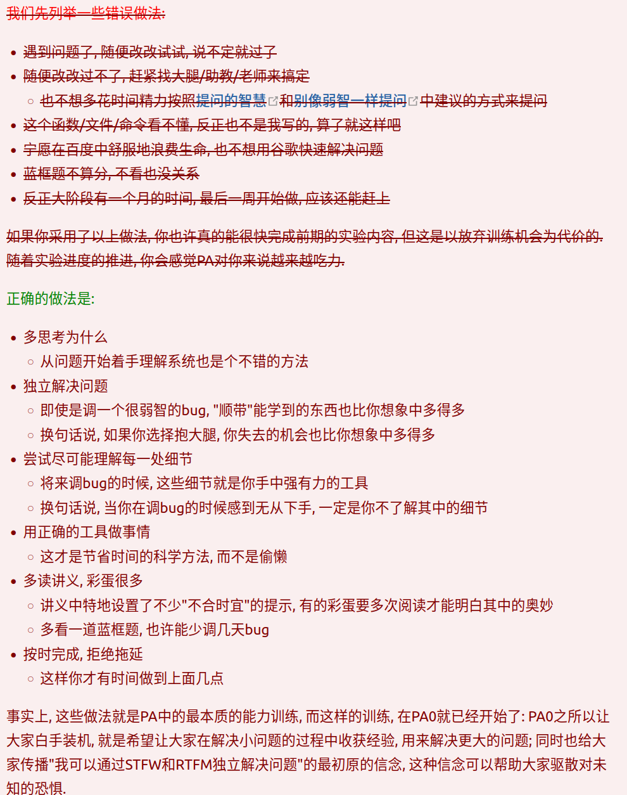
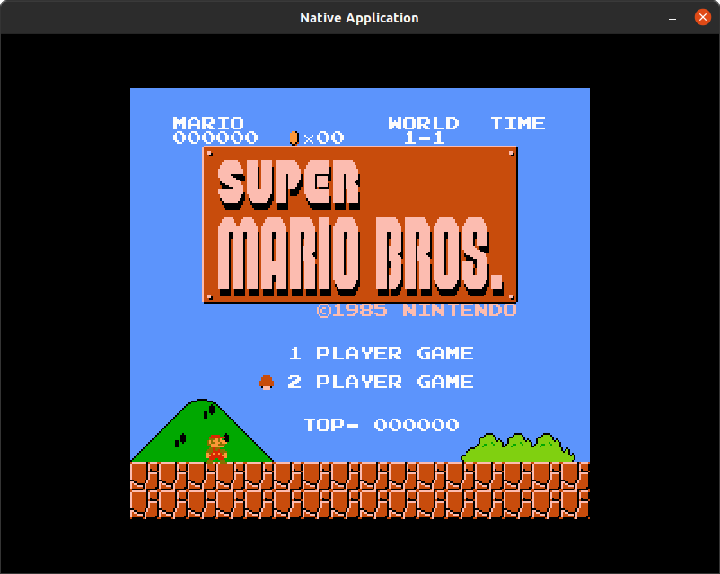

# ysyx-preLearning4

PA1学习记录（终于到这一步了，在数电实验卡了很久）。

## 0. 开始之前

### 0.1 心态准备

从第一页阅读PA1的手册。感觉到一个完全不一样的世界。

> 这也是我去年热血澎湃想做这个事情的原因。

下面是手册中提到的对不同作业的比较：


---

PA实验的目的是实现一个简单完整的计算机系统，来深入理解程序如何在计算机上运行，只有去尝试理解并掌握计算机系统的每一处细节, 才能一步步完成PA。

---



---

> 不得不说上学期的操作系统试点，确实就卡在第三档，对我来说有很大的挑战。

### 0.2 NEMU介绍

PA的目的是要实现NEMU, 一款经过简化的全系统模拟器。PA0中已经克隆了FCEUX--红白机模拟器项目。根据fceux-am的readme进行操作，就可以运行超级玛丽（同样也可以运行其他游戏）。

马里奥游戏运行如下：



### 0.2 测试环境与编译介绍

这里下载了一个新的库来测试自己环境的完整性，经测试挺完备。倒是这个小工具......我一直希望我能够具备设计这种较为完备小软件的能力。

make默认使用单线程，但是对于大项目来说远远不够，并且在的CPU都是多核多线程了, 不把这些计算能力用起来也是白白浪费。`lscpu`命令来查询你的系统中有多少个CPU. 然后在运行 `make`的时候添加一个 `-j?`的参数, 其中 `?`为你查询到的CPU数量。

为了查看编译加速的效果, 你可以在编译的命令前面添加 `time`命令, 它将会对紧跟在其后的命令的执行时间进行统计, 你只需要关注 `total`一栏的时间即可. 你可以通过 `make clean`清除所有的编译结果, 然后重新编译并统计时间, 对比单线程编译和多线程编译的编译时间; 你也可以尝试不同的线程数量进行编译, 并对比加速比.

---

### 0.3 模拟器

所以模拟器是什么，是模拟了一个目标硬件环境，来执行目标硬件环境下的程序。

* 在GNU/Linux中运行Hello World程序
* 在GNU/Linux中通过红白机模拟器玩超级玛丽
* 在GNU/Linux中通过NEMU运行Hello World程序

这三种情况进行比较.

```text
                         +---------------------+  +---------------------+
                         |     Super Mario     |  |    "Hello World"    |
                         +---------------------+  +---------------------+
                         |    Simulated NES    |  |      Simulated      |
                         |       hardware      |  |       hardware      |
+---------------------+  +---------------------+  +---------------------+
|    "Hello World"    |  |     NES Emulator    |  |        NEMU         |
+---------------------+  +---------------------+  +---------------------+
|      GNU/Linux      |  |      GNU/Linux      |  |      GNU/Linux      |
+---------------------+  +---------------------+  +---------------------+
|    Real hardware    |  |    Real hardware    |  |    Real hardware    |
+---------------------+  +---------------------+  +---------------------+
          (a)                      (b)                     (c)
```

可以理解为 NEMU 是一个模拟的计算机系统。在PA的后期, 可以在NEMU中运行经典RPG游戏仙剑奇侠传. 如果完成了所有的选做编程内容, 你甚至可以在NEMU中运行现代文字冒险游戏CLANNAD!

### 0.4 目标机器选择

PA有一个多主线的特性. 具体地, 你需要从[x86](https://en.wikipedia.org/wiki/X86)/[mips32](https://en.wikipedia.org/wiki/MIPS_architecture)/[riscv32(64)](https://en.wikipedia.org/wiki/RISC-V)这三种[指令集架构(ISA)](https://en.wikipedia.org/wiki/Instruction_set_architecture)中选择一种, 来实现"创造属于自己的计算机"这一梦想.

* 如果你打算选熟悉的, 那就选x86, 毕竟ICS理论课主要围绕x86开展. 但你多半会被x86指令的复杂性折磨半死, 而且x86的最终性能其实并不高, 不能流畅地展示游戏的运行.
* 如果你打算选简单的, 那就选riscv32, 你将会体会到什么是"优雅的ISA设计". 由于riscv32的简单, 你可以比较轻松地获得近乎x86两倍的性能, 有着不错的展示效果.
* 如果你接下来打算设计一款riscv64的硬件处理器, 那就选riscv64, 你将会体会到DiffTest是如何帮你大幅提升硬件开发效率, 告别枯燥的波形调试.
  > 是的，我选择这个。梦想在自己的Core上启动自己的系统。
  >
* 如果你打算挑战极限, 那就选mips32: 相比于以上两者, 选择mips32需要了解更多细节才能正确构建出完整的计算机系统. 因此mips32仅供喜欢挑战, 或者攻略二周目的同学选择.

不过无论你选哪种ISA, 有一点是共通的, 那就是RTFM, 因为ISA的本质是规范手册. 另外, NEMU程序本身也是x86的(准确来说是x64), 不会随着你选择的ISA而变化, 变化的只是在NEMU中模拟的计算机.

NEMU的框架代码会把riscv32作为默认的ISA, 如果你希望选择其它ISA, 你需要在NEMU的工程目录下执行 `make menuconfig`, 然后在 `Base ISA`一栏中切换到你选择的ISA, 然后保存配置并退出菜单.

---

最后，提醒自己要记录自己的实验心得。

## 1. 开天辟地的篇章

### 1.1 最简单的计算机

* 编程模型
* 存储程序概念：

  ```C
  while (1) {
    从PC指示的存储器位置取出指令;
    执行指令;
    更新PC;
  }

  ```
* 最简单的真实计算机需要满足哪些条件：

  * 结构上, TRM有存储器, 有PC, 有寄存器, 有加法器
  * 工作方式上, TRM不断地重复以下过程: 从PC指示的存储器位置取出指令, 执行指令, 然后更新PC
* 计算机是个状态机。

### 1.2 计算机是个状态机

给定一个程序, 把它放到计算机的内存中, 就相当于在状态数量为 `N`的状态转移图中指定了一个初始状态, 程序运行的过程就是从这个初始状态开始, 每执行完一条指令, 就会进行一次确定的状态转移. 也就是说, 程序也可以看成一个状态机! 这个状态机是上文提到的大状态机(状态数量为 `N`)的子集.

* 程序的状态机视角有什么好处?
  * 有一些程序看上去很简单,但行为却不那么直观, 比如递归. 要很好地理解递归程序在计算机上如何运行, 从状态机视角来看程序行为才是最有效的做法,因为这一视角可以帮助你理清每一条指令究竟如何修改计算机的状态, 从而实现宏观上的递归语义. ICS理论课的第三章会专门分析其中的细节,
  * 我们在这里就不展开讨论递归的具体行为了.

"程序是个状态机"这一视角对ICS和PA来说都是非常重要的, 因为"理解程序如何在计算机上运行"就是ICS和PA的根本目标. 至于这个问题的宏观视角, 我们将会在PA的中期来介绍.


## 2. RTFSC

这部分在讲解Nemu源码，这个模拟器是如何工作的。
